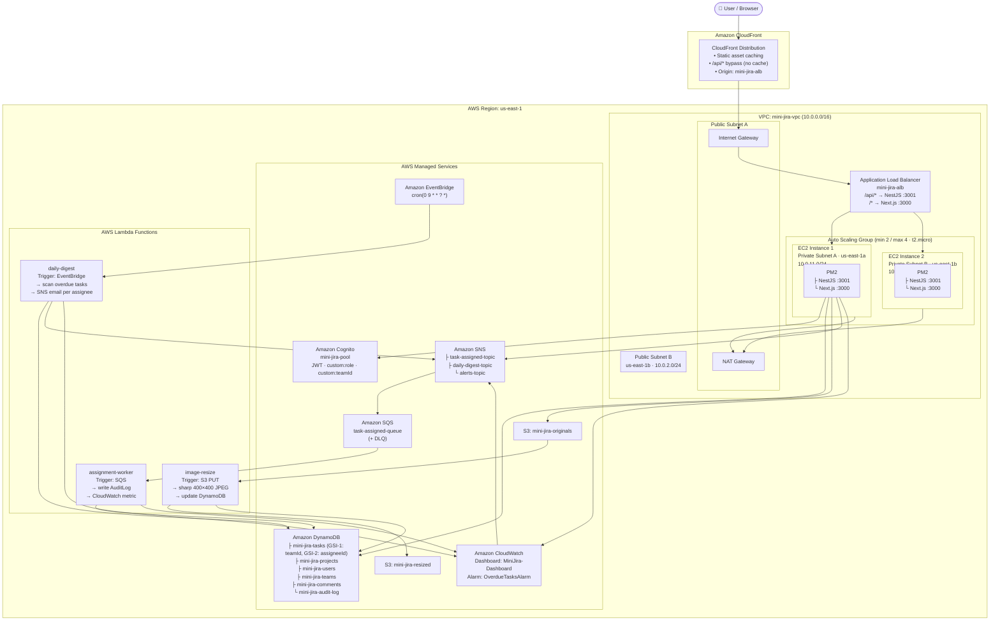

# Mini-Jira on AWS — Submission Document

**Course:** Software Cloud Computing 2026 — Dr. John Zaki
**Team:** Mohamed Abdelsatar, Jessica Ehab, Donia Ali
**Deadline:** 22 May 2026 at 11:59 PM

---

## Live Application

**Public URL:** [https://dqz8pkvihugqe.cloudfront.net](https://dqz8pkvihugqe.cloudfront.net)

Clicking the link opens the live Mini-Jira web application directly. No additional configuration is required.

---

## Architecture Diagram

> **Tool:** Create using [Lucidchart](https://www.lucidchart.com) or Microsoft PowerPoint with the [AWS Architecture Icons](https://aws.amazon.com/architecture/icons/) shape library (download the AWS icon pack and import it).

### High-Availability Architecture Overview

The diagram must illustrate the following topology:

```
Internet
   │
   ▼
┌──────────────────────────────────────────────────────────────────┐
│  Amazon CloudFront (CDN + edge caching)                          │
│  • Caches static assets globally                                 │
│  • Bypasses cache for /api/* (CachingDisabled behavior)          │
│  • Origin: mini-jira-alb                                         │
└──────────────────────────┬───────────────────────────────────────┘
                           │
                           ▼
┌──────────────────────────────────────────────────────────────────┐
│  AWS Region: us-east-1                                           │
│                                                                  │
│  ┌────────────────────────────────────────────────────────────┐  │
│  │  VPC: mini-jira-vpc (10.0.0.0/16)                         │  │
│  │                                                            │  │
│  │  ┌─────────────────┐    ┌─────────────────┐               │  │
│  │  │ Public Subnet A │    │ Public Subnet B │               │  │
│  │  │ us-east-1a      │    │ us-east-1b      │               │  │
│  │  │ 10.0.1.0/24     │    │ 10.0.2.0/24     │               │  │
│  │  │                 │    │                 │               │  │
│  │  │  ┌───────────┐  │    │                 │               │  │
│  │  │  │ NAT GW    │  │    │                 │               │  │
│  │  │  └───────────┘  │    │                 │               │  │
│  │  └────────┬────────┘    └────────┬────────┘               │  │
│  │           │                      │                         │  │
│  │  ┌────────▼──────────────────────▼────────┐               │  │
│  │  │  Application Load Balancer             │               │  │
│  │  │  mini-jira-alb (Internet-facing)       │               │  │
│  │  │  Listener rules:                       │               │  │
│  │  │   /api/* → backend TG (port 3001)      │               │  │
│  │  │   /*     → frontend TG (port 3000)     │               │  │
│  │  └──────────┬─────────────────────────────┘               │  │
│  │             │                                              │  │
│  │  ┌──────────▼──────────────────────────────────────────┐  │  │
│  │  │  Auto Scaling Group: mini-jira-asg                  │  │  │
│  │  │  Min: 2 / Desired: 2 / Max: 4  (t2.micro)          │  │  │
│  │  │                                                     │  │  │
│  │  │  ┌───────────────────┐  ┌───────────────────┐      │  │  │
│  │  │  │ EC2 Instance 1    │  │ EC2 Instance 2    │      │  │  │
│  │  │  │ Private Subnet A  │  │ Private Subnet B  │      │  │  │
│  │  │  │ us-east-1a        │  │ us-east-1b        │      │  │  │
│  │  │  │ 10.0.11.0/24      │  │ 10.0.12.0/24      │      │  │  │
│  │  │  │                   │  │                   │      │  │  │
│  │  │  │ PM2               │  │ PM2               │      │  │  │
│  │  │  │ ├ NestJS :3001    │  │ ├ NestJS :3001    │      │  │  │
│  │  │  │ └ Next.js :3000   │  │ └ Next.js :3000   │      │  │  │
│  │  │  └───────────────────┘  └───────────────────┘      │  │  │
│  │  └─────────────────────────────────────────────────────┘  │  │
│  └────────────────────────────────────────────────────────────┘  │
│                                                                  │
│  ┌─────────────────────────────────────────────────────────────┐ │
│  │  AWS Managed Services (Regional)                            │ │
│  │                                                             │ │
│  │  Amazon Cognito          Amazon DynamoDB                    │ │
│  │  mini-jira-pool          ├ mini-jira-tasks (GSI-1, GSI-2)  │ │
│  │  (JWT auth, roles,       ├ mini-jira-projects              │ │
│  │   custom:teamId)         ├ mini-jira-users                 │ │
│  │                          ├ mini-jira-teams                 │ │
│  │  Amazon S3               ├ mini-jira-comments              │ │
│  │  ├ mini-jira-originals   └ mini-jira-audit-log             │ │
│  │  └ mini-jira-resized                                       │ │
│  │                                                             │ │
│  │  Amazon SNS              Amazon SQS                        │ │
│  │  ├ task-assigned-topic   └ task-assigned-queue (+ DLQ)     │ │
│  │  ├ daily-digest-topic                                      │ │
│  │  └ alerts-topic                                            │ │
│  └─────────────────────────────────────────────────────────────┘ │
│                                                                  │
│  ┌─────────────────────────────────────────────────────────────┐ │
│  │  AWS Lambda Functions                                       │ │
│  │                                                             │ │
│  │  image-resize          assignment-worker    daily-digest    │ │
│  │  Trigger: S3 PUT       Trigger: SQS         Trigger:        │ │
│  │  → sharp resize        → AuditLog write     EventBridge     │ │
│  │  → update DynamoDB     → CloudWatch metric  cron(0 9 * * ?) │ │
│  │                                             → SNS digest    │ │
│  └─────────────────────────────────────────────────────────────┘ │
│                                                                  │
│  Amazon CloudWatch                                               │
│  Dashboard: MiniJira-Dashboard                                   │
│  Alarm: OverdueTasksAlarm (> 10 overdue tasks → SNS alert)       │
└──────────────────────────────────────────────────────────────────┘
```

### How to Draw the Diagram in Lucidchart

1. Open [Lucidchart](https://www.lucidchart.com) → New Diagram → Blank
2. **Import AWS icons:** More Shapes (left panel) → AWS Architecture 2021 → Enable
3. **Draw these layers top-to-bottom, left-to-right:**

| Layer | AWS Icons to Use |
|-------|-----------------|
| Internet user | "Users" or "Client" generic icon |
| CloudFront | `Amazon CloudFront` |
| VPC boundary | Rectangle with label (dashed border) |
| Public subnets | `VPC Subnet (Public)` × 2 |
| NAT Gateway | `NAT Gateway` (in public subnet A) |
| Internet Gateway | `Internet Gateway` (attached to VPC) |
| ALB | `Application Load Balancer` |
| Private subnets | `VPC Subnet (Private)` × 2 |
| EC2 instances | `Amazon EC2 Instance` × 2 (with PM2 label) |
| ASG | `Auto Scaling` bracket around both EC2 icons |
| Cognito | `Amazon Cognito` |
| DynamoDB | `Amazon DynamoDB` (with table names listed) |
| S3 | `Amazon S3` × 2 (originals + resized) |
| Lambda | `AWS Lambda` × 3 (one per function) |
| SNS | `Amazon SNS` |
| SQS | `Amazon SQS` |
| EventBridge | `Amazon EventBridge` |
| CloudWatch | `Amazon CloudWatch` |

4. **Draw arrows for key data flows:**
   - User → CloudFront → ALB → EC2 (NestJS/Next.js)
   - EC2 NestJS → DynamoDB, S3, SNS, CloudWatch
   - SNS → SQS → assignment-worker Lambda → DynamoDB AuditLog
   - S3 PUT → image-resize Lambda → S3 resized + DynamoDB
   - EventBridge → daily-digest Lambda → SNS
   - EC2 → Cognito (JWT validation)

5. **Export** as PNG or PDF and embed the link/file below.

### Architecture Diagram



---

## System Summary

### What It Does

Mini-Jira is a team task management application. Manager Ali can create tasks and assign them to team members. Employees (Sara — Frontend team, Omar — Backend team) each see only their own team's tasks, enforced server-side at the DynamoDB query level via a GSI — not just hidden in the UI.

### Key AWS Services

| Service | Purpose |
|---------|---------|
| **CloudFront** | CDN, edge caching for static assets, single public entry point |
| **ALB** | Routes `/api/*` to NestJS backend, `/*` to Next.js frontend |
| **EC2 ASG** | 2 instances across 2 AZs (min 2 / max 4), auto-scales on load |
| **PM2** | Process manager running both NestJS (port 3001) and Next.js (port 3000) on each instance |
| **Cognito** | User authentication, JWT tokens, custom `role` and `teamId` attributes |
| **DynamoDB** | Multi-table design; Tasks table has GSI-1 (teamId) for team isolation, GSI-2 (assigneeId) for personal views |
| **S3** | Original task image uploads + Lambda-resized thumbnails (400×400 JPEG) |
| **Lambda (image-resize)** | Triggered by S3 PUT, resizes images with `sharp`, updates DynamoDB |
| **SNS + SQS** | Assignment notifications: SNS email to assignee + SQS → Lambda worker |
| **Lambda (assignment-worker)** | Drains SQS, writes AuditLog to DynamoDB, emits CloudWatch metric |
| **EventBridge** | Triggers daily digest Lambda at 09:00 UTC every day |
| **Lambda (daily-digest)** | Scans overdue tasks, sends per-assignee SNS email digest |
| **CloudWatch** | Custom metrics dashboard (4 widgets) + `OverdueTasksAlarm` |
| **VPC** | Network isolation: ALB in public subnets, EC2 in private subnets, NAT GW for egress |

### High Availability Design

- **Two AZs:** All EC2 instances and subnets span `us-east-1a` and `us-east-1b`
- **Auto Scaling Group:** Minimum 2 instances always running; scales to 4 under load
- **ALB health checks:** Unhealthy instances are removed from rotation automatically
- **CloudFront:** Serves cached content even during backend restarts
- **DynamoDB / S3 / Lambda / SNS / SQS:** Fully managed, AWS-native HA

### Team Isolation (Security)

Every task query in `TasksService` checks the caller's JWT role. If `Employee`, a `teamId` filter is appended to the DynamoDB query using GSI-1 — an Employee cannot fetch another team's tasks even by guessing a task ID.
